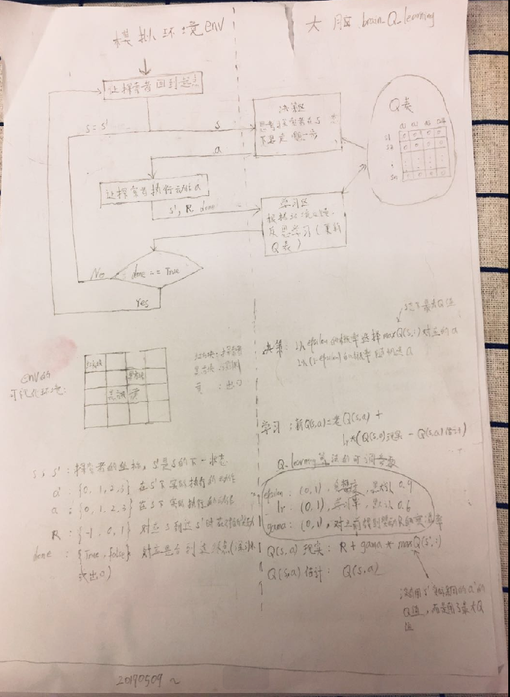

使用Q_Learning算法让机器人走迷宫
=== 

    
   

#调整参数，查看不同参数配置下，机器人的学习速度
---
1. 调整run_this.py中的参数，如下所示
    E_GREEDY：           (0,1)，贪婪度，默认0.9
    py中的LEARNING_RATE：(0,1), 学习率，默认0.6
    REWARD_DECAY：       (0,1)，对之前得到的奖励R的变化率，默认0.9      
2. 在终端中输入： python3 run_this.py，  查看机器人在这种参数配置下的学习速度
3. 回到第一步

#流程图
---

***
***

   
  

