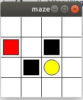

使用Q_Learning算法让机器人走迷宫
=== 
   
  
##流程图
---

***
***

   
  
##模拟环境
-----

---
***
***

##调参数（通过调整以下的参数，来改变探索者的学习速率）
---
epsilon： (0,1)，贪婪度，默认0.9
lr：(0,1), 学习率，默认0.6
gama：(0,1)，对之前得到的奖励R的变化率，默认0.9
***
***
